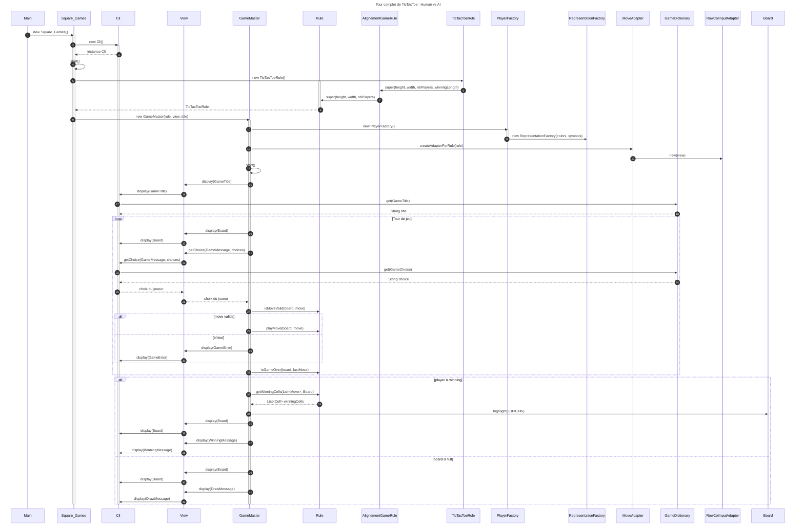

# Square Games Framework

A Java-based framework for implementing square grid board games like TicTacToe, Connect4 and Gomoku.
The framework provides a flexible architecture that allows easy implementation of new games while reusing common components.

## Installation

1. Clone the repository
2. Ensure you have Java JDK 25 or higher installed
3. Build the project using your preferred IDE or build tool

## Usage

Run the Main class to start the application. The game will present a menu where you can:

1. Choose a game type (TicTacToe, Connect4, Gomoku)
2. Select number of human/AI players
3. Configure board size
4. Play the game using console commands

## Project Structure

The project follows a Model-View-Controller architecture:

- **Model**: Contains game logic classes (Board, Cell, Player)
- **View**: Handles user interface and display (View, InteractionUser)
- **Controller**: Manages game flow and rules (Game, Connect4, TicTacToe)

## Class Diagram

The following class diagram shows the relationship between major components:

```mermaid
classDiagram

   class ArtificialIntelligence {
    <<Interface>>
    + getNextMove(Board) Move
    }
    
  class ArtificialPlayer {
    - ArtificialIntelligence ai
    + getNextMove(Board, MoveInputAdapter) Move
    }
    
  class Board {
    # Cell[][] cells
    + width() int
    + isPlayable(Move) boolean
    + height() int
    + getPlayableMoves() List~Move~
    + getCell(int, int) Cell
    + isFull() boolean
    + playMove(Move, Player) void
  }
  
  class Cell {
    - Player owner
    - String representation
    + getRepresentation() String
    + setOwner(Player) void
    + getOwner() Player
    + isEmpty() boolean
  }

    class Connect4 {
    # MoveInputAdapter adapter
    - int winningLength
    + start() void
    # play() void
    # isWinning(Move) boolean
    # menu() void
    # initGame(int, int, int, int) void
    }
    class Connect4AI {
    + getNextMove(Board) Move
      }
      class Connect4Board {
    + playMove(Move, Player) void
    + isPlayable(Move) boolean
    + getRow(int) int
    + getPlayableMoves() List~Move~
      }
      class Connect4InputAdapter {
    - InteractionUser interact
    + getMoveFromHumanPlayer(HumanPlayer, Board) Move
      }
      class Connect4Move {
    - int col
    + getCol() int
      }
      class Game {
    # View view
    # Board _old.board
    # PlayerFactory playerFactory
    # List~Player~ players
    # InteractionUser interact
    + start() void
    # isWinning(Move) boolean
    # menu() void
    # initGame(int, int, int, int) void
    # play() void
    # countInDirection(int, int, int, int, int) int
    # clamp(int, int, int) int
    # getNextPlayer(Player) Player
    # makeAlignment(int, int, int) boolean
    }
    class HumanPlayer {
    + getNextMove(Board, MoveInputAdapter) Move
      }
      class InteractionUser {
    - Scanner scanner
    - View view
    + getChoice(String, String[]) int
    + getInt(String) int
    + getString(String) String
    + getInt(String, int, int) int
      }
      class Main {
    + main(String[]) void
      }
      class Move {
    # int playerId
    + getPlayerId() int
      }
      class MoveInputAdapter {
      <<Interface>>
    + getMoveFromHumanPlayer(HumanPlayer, Board) Move
      }
      class Player {
    - int id
    - String representation
    + getNextMove(Board, MoveInputAdapter) Move
    + getId() int
    + getRepresentation() String
      }
      class PlayerFactory {
      ~ InteractionUser interact
      ~ Class~Game~ gameClass
      ~ List~Color~ possibleColors
    + createPlayers(int, int) List~Player~
    + createHumanPlayer(int, char, Color, InteractionUser) Player
    + createArtificialPlayer(int, char, Color, ArtificialIntelligence) Player
    - createAI() ArtificialIntelligence
      }
      class TicTacToe {
    # MoveInputAdapter adapter
    - int winningLength
    + start() void
    # play() void
    # initGame(int, int, int, int) void
    # menu() void
    # isWinning(Move) boolean
    }
    class TicTacToeAI {
    + getNextMove(Board) Move
      }
      class TicTacToeBoard {
    + isPlayable(Move) boolean
    + playMove(Move, Player) void
    + getPlayableMoves() List~Move~
      }
      class TicTacToeInputAdapter {
    - InteractionUser interact
    + getMoveFromHumanPlayer(HumanPlayer, Board) Move
      }
      class TicTacToeMove {
    - int col
    - int row
    + getRow() int
    + getCol() int
      }
      class View {
    + String BLUE
    + String GREEN
    + String RESET
    + String RED
    + String YELLOW
    - boolean maximize
    + displayBoard(Board) void
    + displayWarning(String) void
    + display(String) void
    + displayTitle(String) void
    + setMaximize(boolean) void
    + displaySuccess(String) void
    + displayError(String) void
      }
    
    ArtificialPlayer "1" *--> "ai 1" ArtificialIntelligence
    ArtificialPlayer  -->  Player : extends
    HumanPlayer  -->  Player : extends
    
    Board "1" *--> "cells *" Cell : contains
    Cell "1" *--> "owner 1" Player : ownedBy
    Connect4  -->  Game : extends
    Connect4 "1" *--> "adapter 1" MoveInputAdapter
    Connect4AI  ..>  ArtificialIntelligence
    Connect4Board  -->  Board
    Connect4InputAdapter "1" *--> "interact 1" InteractionUser
    Connect4InputAdapter  ..>  MoveInputAdapter
    Connect4Move  -->  Move : extends
    Game "1" *--> "_old.board 1" Board
    Game "1" *--> "interact 1" InteractionUser
    Game "1" *--> "players *" Player
    Game "1" *--> "playerFactory 1" PlayerFactory
    Game "1" *--> "view 1" View
    
    InteractionUser "1" *--> "view 1" View
    PlayerFactory "1" *--> "possibleColors *" Color
    PlayerFactory "1" *--> "interact 1" InteractionUser
    TicTacToe  -->  Game
    TicTacToe "1" *--> "adapter 1" MoveInputAdapter
    TicTacToeAI  ..>  ArtificialIntelligence
    TicTacToeBoard  -->  Board
    TicTacToeInputAdapter "1" *--> "interact 1" InteractionUser
    TicTacToeInputAdapter  ..>  MoveInputAdapter
    TicTacToeMove  -->  Move 
```

# Game Flow Sequence

The sequence diagram below illustrates a complete turn in TicTacToe between a human player and AI:

